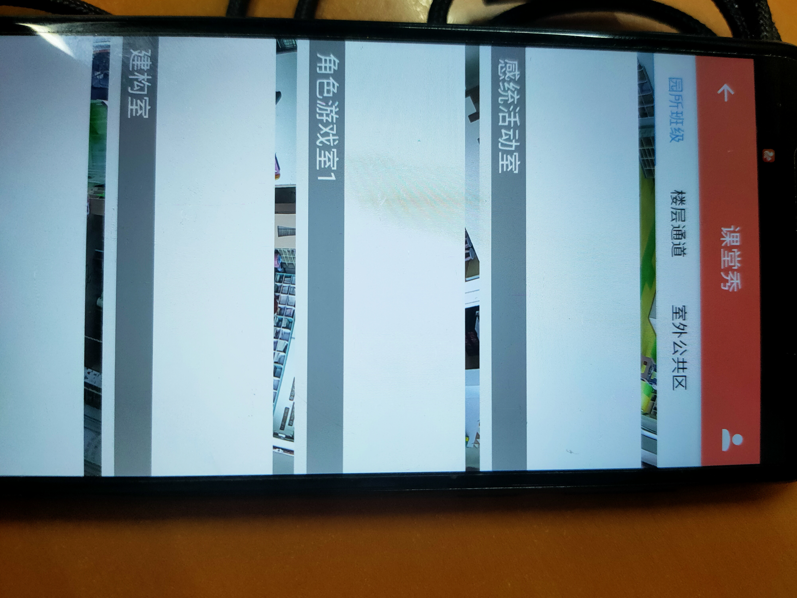

# 青浦阳光宝贝幼儿园

验证 React Native

## 准备环境

- 参考 React Native 官网配置开发环境
- [yarn](https://yarnpkg.com/)
  代替 npm 管理依赖

## 功能列表

- [x] 引入`js-Logger`日志库
- [x] 请求二次封装
- [x] 自定义字体

1. 在根目录下新建文件夹 src/assets/fonts/, 把 ttf 字体文件引入
2. 在 react-native.config.js 下添加：

```
module.exports = {
  dependencies: {
  },
  "assets": [
    "./src/assets/fonts/"
  ]
};
```

3. 执行：react-native link
4. 样式： fontFamily:'PingFang-SC-Regular'

## 调试

### [react-native-debugger](https://github.com/jhen0409/react-native-debugger)

第一步:

CLI 启动命令

```
open "rndebugger://set-debugger-loc?host=localhost&port=8081"
```

第二步:

打开 React Native Debug Menu，选择 Debug in chrome

## 验证
- 视频或者监控组件播放组件


- Android和IOS更新组件


- 不同分辨率、长宽比手机的 UI 支持如何实现
  React Native 采用逻辑分辨率
  手机端 UI 一般还原设计稿

  https://segmentfault.com/a/1190000039805723

- UI 的驱动模式如何设计？事件驱动还是？
  事件驱动

- iOS 和 android 的 API 差异性如何兼容？
  https://reactnative.dev/docs/platform-specific-code
  官方提供两种方式

- 更新机制
  应用更新安卓采用 apk 更新

- 全局状态管理
  react-redux 管理


## 原生设计


